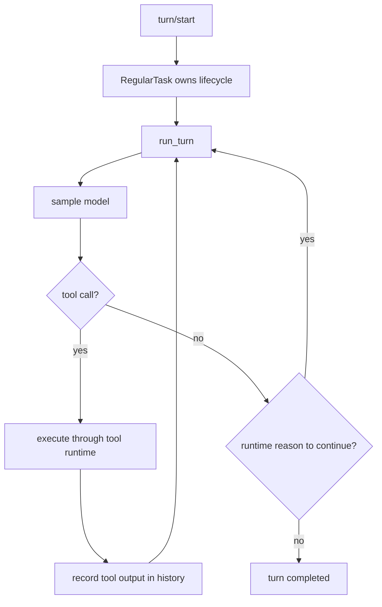
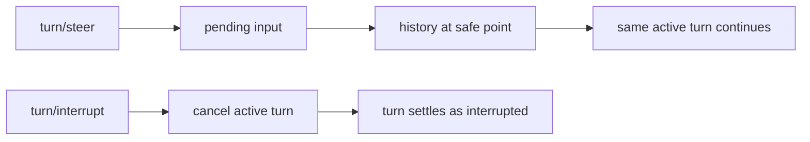

<!-- notion-sync: 37c4e07a-a023-8103-b020-e7336f1c7a59 parent=codex blogs url=https://app.notion.com/p/37c4e07aa0238103b020e7336f1c7a59 -->

The first trap in the Codex source is vocabulary. You quickly meet `turn/start`, `RegularTask`, `run_turn`, pending input, pending work, steering items, mailbox events, and interrupts.

Explaining those names one by one produces a glossary, but not understanding. The names live at different layers. Some are protocol actions. Some are task state. Some become model-visible history. Some wake an idle thread later.

The through-line I want to keep is simpler:

> A Codex turn is not a single request to the model. It is a managed execution window that can accept more input, call tools, write evidence back into history, be cancelled, and eventually settle.

Start with a normal task:

```text
Fix this failing test.
```

Codex does not send that sentence to the model and wait for one final answer. The app server receives `turn/start`, creates an in-progress turn, starts a regular task, and enters the core loop. The model may inspect files, run tests, read output, patch code, run tests again, and summarize only after the runtime has enough evidence.

Every tool result becomes part of history. The next model request is grounded in what happened, not in what the model guessed would happen.



## `turn/start` opens an execution window

`turn/start` is a protocol entry point. The client sends user input and may attach turn-level configuration such as model, working directory, sandbox behavior, approval policy, or permission profile. The app server returns a turn object and streams events as the work runs.

The important distinction is:

```text
Protocol layer: "start a turn"
Core layer:     "run a managed task that may sample the model many times"
```

A useful source-shaped call path is:

```text
turn/start
  -> create or activate turn
  -> RegularTask::run
  -> run_turn
  -> run_sampling_request
```

`RegularTask::run` owns the outer lifecycle. It emits the start event, holds the cancellation token, and calls `run_turn` until the active turn has no more input waiting to be consumed.

That outer loop explains why `turn/steer` does not need to create a new turn. Steering input enters a pending-input queue owned by the active turn. When `run_turn` reaches a safe point, the regular task can continue the same execution with that newly recorded input.

## `run_turn` is the agentic loop

The toy version of an agent loop looks like this:

```python
while True:
    response = model(messages)
    if response.tool_call:
        messages.append(run_tool(response.tool_call))
    else:
        break
```

That explains tool calling, but it does not explain Codex. A production coding agent also needs mid-flight user input, cancellation, sandbox and approval policy, context compaction, stop hooks, event streaming, rollout recovery, and cross-agent messages.

A better question for `run_turn` is:

> After this sample, is there any reason the runtime must take another step?

The reason may come from the model: it asked for a tool call. It may also come from the runtime: a compacted history needs continuation, a stop hook requires another pass, a pending input is now safe to drain, or an interrupt requires the loop to stop even if the model wants to continue.

One pass through the loop roughly does this:

1. Record input from `turn/start` or from a safe pending-input drain.
2. Build a sampling request from model-visible history, instructions, tool schemas, output schema, and turn configuration.
3. Sample the model.
4. Execute tool calls through routing, policy, sandboxing, approval, and side-effect handling.
5. Write the result back into history as evidence for the next sample.

The last step is the heart of the design. Tool output is not only a UI log. It is a fact that the next model call must see.

## Steering is not interruption

Imagine the user adds a constraint while Codex is already working:

```text
Actually, prioritize the API layer. Do not touch the UI.
```

That should not create a brand-new task. It also should not kill the command that is already running. It is mid-flight input, so it goes through `turn/steer`: accepted now, drained later at a safe boundary.

```text
turn/steer
  -> pending input
  -> safe point
  -> conversation item in history
  -> same active turn continues
```

`turn/interrupt` is different. It requests cancellation for the active turn. A later user message may start a new turn, but the interrupt itself is not a new instruction. It is the runtime boundary that says the current execution ends here.



## Pending input, pending work, and runtime steering

These names sound related, but they answer different questions.

| Name | Belongs to | Question |
| --- | --- | --- |
| Pending input | Active turn | Should this user message become part of the turn already running? |
| Pending work | Idle thread | After the current turn settles, is there more work that should wake the thread? |
| Runtime steering | Model-visible history | Does the runtime need to inject a control constraint such as budget, stop-hook, or compaction continuation? |

All three can make execution continue. They do not come from the same layer.

## Why the boundaries are this fine-grained

For a toy agent, `while model -> tool -> model` is enough. For a coding agent, it is not.

A user may add constraints while tests are running. A shell command may need cancellation. A patch may require approval. A sandbox may block a file write. The context window may fill and require compaction. A model may summarize too early, and a stop hook may need to pull it back. A subagent may send a mailbox result.

Those are runtime-boundary problems, not only model-quality problems.

The source becomes easier to read when split into layers:

| Layer | Question it answers | Typical names |
| --- | --- | --- |
| Protocol | How does the outside world start, add to, cancel, and observe a turn? | `turn/start`, `turn/steer`, `turn/interrupt`, event stream |
| Task | Who owns lifecycle and cancellation? | `RegularTask`, `SessionTask`, cancellation token |
| History | What does the model actually see next? | response items, tool output, steering item |
| Tool runtime | How are actions routed, authorized, executed, and recorded? | tool router, sandbox, approval |
| Control | What forces continuation or stop? | pending input, compaction, stop hooks, mailbox, pending work |

## Source-reading checklist

When reading this part of Codex, do not start by asking "where is the loop?" Start with:

```text
Who created the active turn?
Who owns its cancellation token?
What input is already in history, and what input is only pending?
Which model-visible items are user-authored versus runtime-authored?
What tool results were written back as evidence?
Why did the loop decide to continue?
Why was it allowed to stop?
```

That checklist is more useful than memorizing function names. Codex's agentic loop is not only `while tool`. It is a managed boundary between user intent, model sampling, tool side effects, history, and cancellation.

## Source map

- `codex-rs/app-server/README.md` for turn protocol shape and event semantics.
- `codex-rs/core/src/tasks/regular.rs` for the regular task lifecycle.
- `codex-rs/core/src/session/turn.rs` for the model/tool/history loop.
- Tool routing and runtime modules for authorization, sandbox, and tool-output recording.
