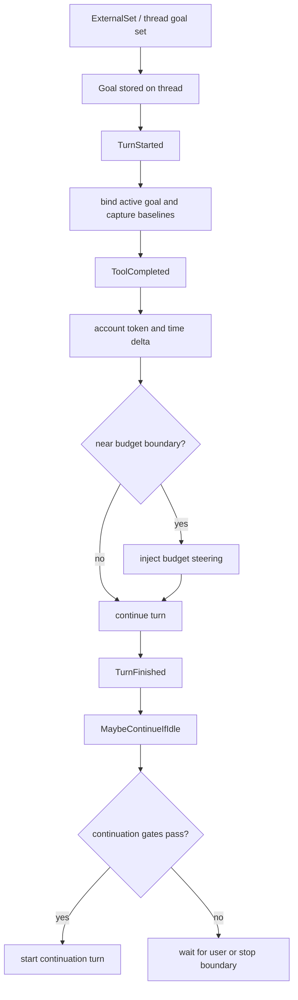

<!-- notion-sync: 37c4e07a-a023-8105-b6f1-fc49946cb014 parent=codex blogs url=https://app.notion.com/p/37c4e07aa0238105b6f1fc49946cb014 -->

The first Codex source-dive note treated a turn as a runtime boundary rather than a single model call. A Goal needs the same lens.

The name is deceptive. It sounds like a line in a prompt:

```text
Reduce checkout p95 latency below 120 ms, verified by the checkout benchmark,
while keeping the correctness suite green.
```

The shallow interpretation is that Codex inserts that sentence into the system prompt and asks the model to remember it.

The stronger interpretation is:

> A Codex Goal is not a prompt. It is a thread-level long-running task state machine.

A prompt answers one question: what should the model see on the next sample? A Goal has to answer more:

```text
Where is the objective stored?
When is it restored?
When may work continue without a new user message?
Who is allowed to change status?
How are token and time usage counted?
What happens at budget or usage boundaries?
```

## Prompt versus Goal

A normal prompt says: "Try to optimize checkout latency now."

A Goal is closer to a contract:

| Field | Why it matters |
| --- | --- |
| Objective | The durable thing the thread is trying to accomplish |
| Evidence | The benchmark, test, or check that proves progress |
| Constraints | Correctness suite, API stability, safety boundaries |
| Status | Active, paused, blocked, complete, budget-limited, usage-limited |
| Ledger | Token usage, elapsed time, and budget state |
| Continuation | Whether another autonomous turn is allowed |
| Authority | Which mutations come from user, runtime, or model |

That is why Goal cannot be reduced to "put the objective into the prompt." Prompting is one input to the next model call. Goal is a durable runtime object attached to the thread.

## Why Goal belongs to a thread

From the app-server perspective, Goal is already thread-level. Interfaces such as `thread/goal/set`, `thread/goal/get`, and `thread/goal/clear` operate on the current thread, not on one assistant message or one turn.

That boundary is natural. A long-running objective needs state:

```text
goal id
objective text
status
budget limits
token usage
elapsed time
last accounting baseline
resume state
latest blocker or completion signal
```

If that state lived only inside one prompt, it would be lost when context changed, the app restarted, or the next turn began. If it lived globally, it could bleed across unrelated threads. The thread owns the project conversation, rollout, tool evidence, and user intent, so the thread should own the Goal.

The key sentence:

> A Goal is not owned by a turn. A Goal outlives turns and uses turns as execution checkpoints.

## Runtime events make the Goal real

The Goal runtime observes boundaries around the normal turn runtime. Event names that look scattered at first become readable when treated as checkpoints:



Those events are not random hooks. They mark points where a long-running objective must update its ledger or decide whether work may continue.

At `TurnStarted`, the runtime binds the active turn to the active Goal and captures accounting baselines.

At `ToolCompleted`, it can count incremental usage, check budget, and inject steering if the task is at a boundary.

At `TurnFinished`, it finalizes usage and decides whether an idle continuation should even be considered.

At `MaybeContinueIfIdle`, it runs the continuation gate.

At `UsageLimitReached`, it stops substantive work and surfaces the boundary honestly.

At `ThreadResumed`, it rebuilds runtime state after a session comes back.

Without those events, Goal would only be another instruction. With them, it becomes an operating mechanism.

## Budget-limited is not complete

One of the most useful design distinctions is:

> Budget exhausted is not the same as Goal complete.

If checkout p95 moves from 180 ms to 130 ms and the budget runs out, the objective is not complete. It is budget-limited. The runtime boundary forced a stop; it did not prove success.

That distinction protects trust. A long-running agent should be able to say:

```text
I made progress.
I verified these parts.
I hit this budget or usage boundary.
The objective is not yet complete.
```

That answer is less dramatic than pretending success, but much more useful.

## Continuation must pass gates

For a normal turn, completion usually means the assistant waits for the user. For an active Goal, a completed turn may only be a checkpoint. The runtime must ask whether another autonomous turn is safe and useful.

A simplified gate looks like this:

```text
on MaybeContinueIfIdle:
    if thread is not idle: stop
    if queued user input exists: stop and let the user win
    if goal is not active: stop
    if current mode is Plan mode: suppress continuation
    if token budget or usage limit is reached: stop substantive work
    if previous continuation produced no counted autonomous activity: suppress next continuation
    else: start a continuation turn
```

This is the difference between autonomy and runaway looping. Continuation happens at an idle boundary. User input wins. Plan mode suppresses execution. Empty continuations are not allowed to keep paying for self-talk.

The mental model is:

```text
Goal continuation = turn-level autonomy after explicit runtime gates
```

not:

```text
Goal continuation = loop until the model says it is done
```

## Authority boundary

A long-running task becomes unsafe if the model can freely rewrite its own contract. Codex's design separates authority.

| Owner | Responsibilities |
| --- | --- |
| User and app server | Set, get, clear, pause, resume, and external limits |
| Runtime | Accounting, continuation gates, budget steering, usage-limit behavior, resume |
| Model | Read the Goal, report progress, and provide evidence for complete or blocked states |

This split keeps user intent above autonomous behavior. The user can clear or modify the Goal. Queued user input wins over continuation. Plan mode prevents silent execution. These are governance rules, not UI details.

## Resume is the test

Persistence is where the prompt interpretation breaks completely.

If the app restarts, a prompt-only Goal has no reliable state. It may be missing usage totals, blockers, baselines, and continuation state. It has no principled way to decide whether it is safe to resume.

A thread-level Goal can be restored. On `ThreadResumed`, the runtime can rebuild the active Goal state from stored thread data and rollout. It can know whether the Goal was active, paused, limited, or complete, what usage had already been counted, and whether continuation is allowed.

That is the difference between memory and state:

```text
Memory: "The model may remember the objective."
State:  "The runtime can restore the objective and its ledger."
```

For long-running coding work, state wins.

## Reusable lesson

The Goal mechanism is a useful design pattern for any long-running agent:

| Requirement | Why it matters |
| --- | --- |
| Thread ownership | The objective belongs to the project conversation, not a single sample |
| Persistence | The task must survive context changes and restarts |
| Accounting | Autonomous work needs a visible cost ledger |
| Continuation gates | The agent must not run forever or override the user |
| Authority separation | The model should not unilaterally rewrite its contract |
| Honest boundary states | Budget-limited and usage-limited are not complete |

"Goal is just a prompt" hides the hard part. The hard part is not telling the model what the user wants. The hard part is building a runtime that can keep working without lying, looping, or stealing control from the user.

## Source map

- `codex-rs/core/src/goals.rs` for Goal runtime events, accounting, continuation, and resume behavior.
- `codex-rs/app-server/README.md` for `thread/goal/set`, `thread/goal/get`, and `thread/goal/clear`.
- `codex-rs/core/src/tools/handlers/goal_spec.rs` for model-facing Goal tools and authority boundaries.
- Turn and task modules from the first source-dive note, because Goal wraps the turn lifecycle rather than replacing it.
