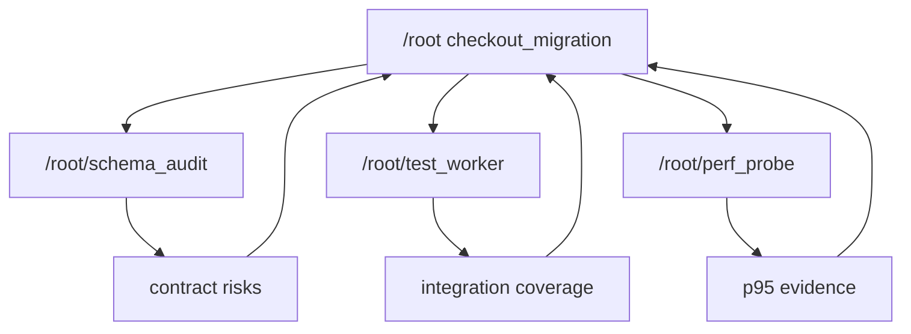

<!-- notion-sync: 37c4e07a-a023-8150-b043-ffe641c10be9 parent=codex blogs url=https://app.notion.com/p/37c4e07aa0238150b043ffe641c10be9 -->

The first Codex source-dive note argued that a turn is not a single model call. It is a managed runtime boundary.

The second argued that a Goal is not a prompt. It is a thread-level long-running state machine.

Subagents continue the same story. What happens when a task is too large for one turn and too wide for one agent to push linearly?

The shallow answer is: the model calls `spawn_agent`, and Codex runs extra model calls in parallel.

That misses the design.

> A Codex subagent is not a temporary tool call. It is a persistent child thread in a session-level thread tree.

`spawn_agent` is only the front door. The real system is built from child threads, forked history, agent paths, mailboxes, status subscriptions, interrupts, registry limits, and parent-child spawn edges that can be restored later.

## A task wants a tree

Take a migration task:

```text
Migrate the checkout service from the old payment client to the new billing SDK.

Requirements:
- identify API contract risks;
- update adapter and call sites;
- add integration tests;
- run the checkout benchmark;
- produce a final risk list with evidence.
```

This naturally splits into several shapes:

```text
Main path: understand the adapter and decide patch direction.
Side paths: audit contracts, add tests, run benchmark.
Integration: merge findings and choose trade-offs.
```

If the root agent does everything itself, its context fills with contract details, test logs, benchmark output, and side investigation notes. If it fires one-off model calls, the side tasks have no durable identity. They cannot be followed up, interrupted, listed, resumed, or archived as part of the same work tree.

Codex chooses a third shape:



The root keeps the main patch. `schema_audit` compares contracts. `test_worker` adds coverage. `perf_probe` runs benchmarks. The root can keep working, then wait, message, interrupt, or integrate as results appear.

Multi-agent Codex is therefore not "more models thinking at once." It is a root agent organizing work as a tree of named, recoverable threads.

## `AgentControl` is the control plane

The best entry point is not the list of tools. It is `AgentControl`.

`AgentControl` is the control-plane handle for multi-agent work. It is attached to session services, and a root thread or session tree shares one `AgentControl` across descendants.

That scope matters. If every child had its own control plane, the root would not have a stable view of the team. Status updates, interrupts, mailboxes, and spawn edges would scatter across unrelated state.

You can think of `AgentControl` as a small team dispatcher:

```text
spawn an agent
send input and inter-agent messages
interrupt an agent
subscribe to agent status
list agents in the tree
record parent -> child spawn edges
restore descendants when a session resumes
```

Each agent thread still runs its own turns, tools, and history. `AgentControl` manages existence, identity, communication, and lifecycle.

## Registry means identity and capacity

`AgentRegistry` sounds like a plain list, but it carries two important runtime properties.

First, it enforces capacity. A session tree cannot spawn unlimited subagents. The registry tracks count and reserves spawn slots before admitting a new child. That prevents recursive spawning from becoming resource explosion.

Second, it maintains identity:

```text
agent_id
agent_path
agent_nickname
agent_role
last_task_message
```

Addressability is not cosmetic. A collaborative agent needs a name that can be used in messages, waits, follow-ups, and interrupts.

If the current agent is `/root` and it spawns:

```json
{
  "task_name": "schema_audit",
  "message": "Compare the old payment client contract with the new billing SDK."
}
```

the child can be addressed as:

```text
/root/schema_audit
```

If `/root/migration_worker` spawns `validator`, that child becomes:

```text
/root/migration_worker/validator
```

That is where the tree comes from.

## `spawn_agent` materializes a child thread

The `spawn_agent` handler does much more than pass a task string to another model.

A useful skeleton is:

```text
parse arguments:
    message, task_name, agent_type, model, reasoning_effort, service_tier, fork_turns

parse fork mode:
    none / all / last N turns

build child configuration from parent turn:
    cwd, sandbox, approval policy, permission profile, shell environment policy

apply role and model overrides:
    role config, nickname, instructions, reasoning, service tier

construct subagent source:
    parent_thread_id, depth, agent_path, agent_role

call AgentControl.spawn_agent_with_metadata
persist parent-child edge
send initial input to the child thread
```

The real work is boundary-setting.

What context does the child inherit? That is `fork_turns`.

What role does it play? That is `agent_type` and role config.

Where does it execute? It inherits the current runtime world: working directory, sandbox, approval policy, permission profile, selected environment, and shell policy.

How will it be addressed later? It receives a path, nickname, role, parent id, and depth.

Can it be recovered later? The parent-child spawn edge is persisted.

None of that fits "parallel call the model."

## Inheritance preserves the execution world

Subagents inherit key runtime state from the parent, including shell snapshot and execution policy.

That is not convenience. It is correctness.

If a child silently starts in a different directory or under a different execution policy, its tests and file reads may not be comparable to the root's work. The child would report facts from a different world.

Inheritance keeps the team in the same operating reality. The child has its own history and role, but its tool calls run under compatible runtime assumptions.

This is especially important for coding tasks, where "I ran the benchmark" only means something if it was run in the same repo state and policy envelope as the patch being reviewed.

## Forking is context design

`fork_turns` is not just copying text. It is a context boundary.

| Fork mode | Shape | Trade-off |
| --- | --- | --- |
| `none` | Child starts from task message and runtime policy | Cleanest context, but may miss important background |
| `last N` | Child receives a bounded slice of recent parent context | Usually the best default for narrow side tasks |
| `all` | Child receives the relevant rollout | Useful when the side task needs full history, expensive when it does not |

The child history becomes its own after the fork. It records its own tool calls, evidence, messages, and mistakes. The parent can wait on it or read results, but the child is not merely a paragraph inside the parent's prompt.

Good subagent design is mostly context design: narrow enough to finish, connected enough to matter.

## Communication is not function return

Once a child is alive, the parent needs several kinds of interaction:

| Operation | Meaning |
| --- | --- |
| `send_message` | Put information in the target mailbox; do not necessarily wake it |
| `followup_task` | Send work with trigger semantics; may start another turn if idle |
| `wait_agent` | Wait for mailbox or status updates from a child thread |
| `interrupt_agent` | Cancel a child's active turn |
| `list_agents` | Inspect the current tree of known agents |

This is the difference between communication and function calls. Function calls return. Agents communicate over time.

When `schema_audit` finishes, the root should receive contract risks, evidence, uncertain points, and recommended follow-up. When `perf_probe` finishes, the root should receive benchmark output and interpretation. Those results become messages the parent can act on.

## Resume proves it is a thread tree

Persistence is the final test.

If the app restarts while the checkout migration is in progress, the root should not forget that `schema_audit`, `test_worker`, and `perf_probe` existed. The runtime needs to restore descendant agents from persisted spawn edges and rebuild the registry view.

That gives lifecycle benefits:

```text
list_agents still shows the team
wait_agent can still refer to a restored child
archive/delete can apply to the descendant tree
status can be reconstructed from thread state
messages can continue to use stable agent paths
```

If subagents were temporary futures, recovery would be guesswork. With a thread tree, recovery becomes a graph operation.

## Reusable lesson

Codex treats collaboration as runtime structure, not just model prompting.

| Property | Why it matters |
| --- | --- |
| Identity | A child can be addressed, listed, waited on, and interrupted |
| Context boundary | A side task can work with a curated view |
| Runtime inheritance | Children run in a compatible execution world |
| Communication | Agents exchange messages over time, not just strings |
| Capacity control | Recursive spawning has a hard limit |
| Persistence | Descendants can be restored with the session tree |

The main lesson is sharp:

> Multi-agent support is not primarily about parallelism. It is about turning delegation into recoverable, bounded, addressable work.

## Source map

- `codex-rs/core/src/agent/control.rs` for `AgentControl` and the shared control-plane model.
- `codex-rs/core/src/agent/registry.rs` for capacity limits, identity, metadata, and nickname handling.
- `codex-rs/core/src/tools/handlers/multi_agents_v2/spawn.rs` for `spawn_agent` and child-thread materialization.
- `codex-rs/core/src/tools/handlers/multi_agents_v2/message_tool.rs` for messaging, follow-up, waiting, and interruption semantics.
- Thread persistence and app-server lifecycle code for archive, delete, resume, and descendant restoration.
