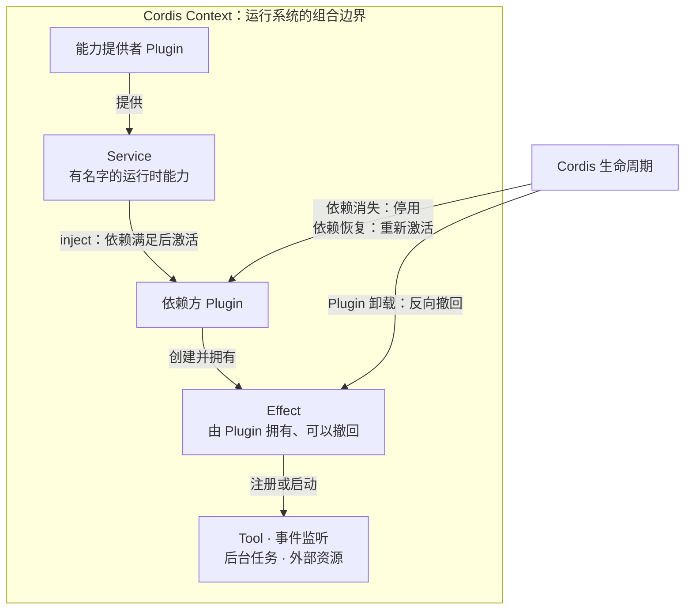
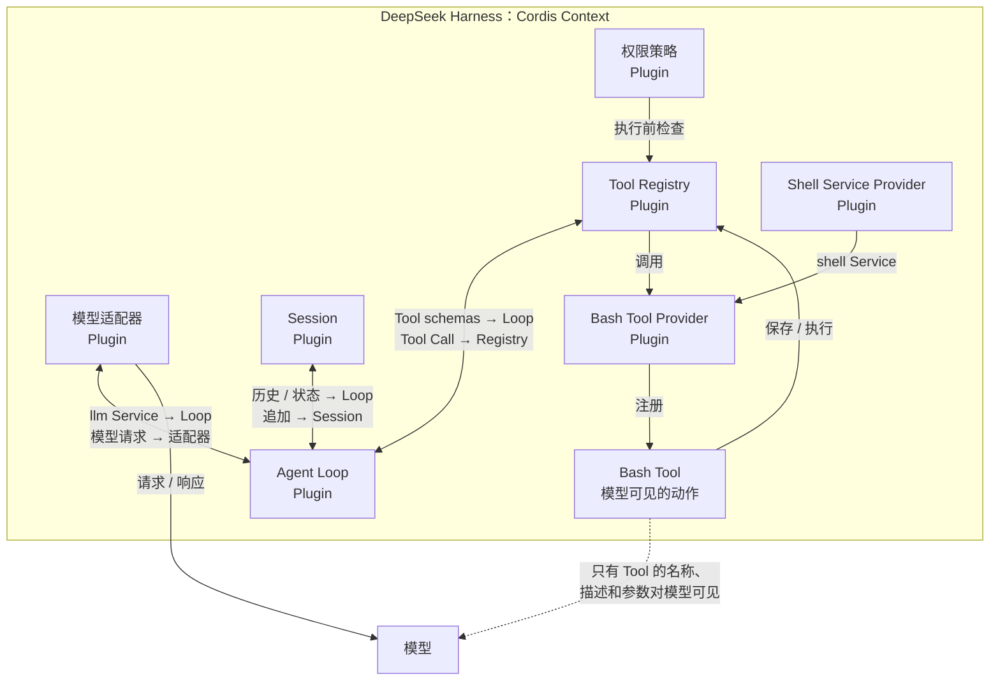

**如果 Agent Loop 本身也是 Plugin，这个系统的“本体”还剩下什么？**

TLDR：在 DeepSeek Harness 中，Plugin 不是给 Agent 增加一个 Tool 的外围附件，而是组成运行系统的基本单位。Cordis 让模型接入、Session、Tool Registry 和 Agent Loop 等职责通过同一种方式进入系统；Tool 只是其中部分 Plugin 提供给模型的动作接口。

> 版本说明：本文依据 DeepSeek Harness commit [`47f94385`](https://github.com/deepseek-ai/deepseek-harness/commit/47f943859bef60e4160492346772ded9b24f765a) 核验，时间为 2026 年 8 月 16 日。该版本对应 `dsh@0.1.0-rc.5`。项目仍处于开发者预览阶段，后续版本可能改变本文介绍的设计。

“搜索插件”很好理解。软件本来就能运行，装上插件以后多了一项搜索功能；把插件删掉，搜索不见了，软件还是原来的软件。

DeepSeek Harness 里的 Plugin 不是这个意思。模型适配器是 Plugin，Session Log 和 Tool Registry 是 Plugin，就连默认的 Agent Loop 也是 Plugin。这些部分并非挂在完整 Agent 运行系统外面的附加功能，它们本来就是运行系统的组成部分。

所以，本篇先要拆开两个问题。Plugin 的边界深入到 Agent Loop 以后，它究竟指什么？它与模型能够调用的 Tool 又是什么关系？

第一个问题要从 Cordis 讲起。第二个问题，用 Bash 就能说明白。

## 1. Cordis 把 Plugin 边界推到了应用内部

常见插件系统先有一个宿主应用。宿主掌握主要状态和控制流程，再从边缘开放一些扩展位置。插件可以增加命令、面板或文件格式，却通常不能替换宿主的主要运行方式。

[Cordis](https://github.com/deepseek-ai/deepseek-harness/blob/47f943859bef60e4160492346772ded9b24f765a/docs/cordis-primer.md) 选择了另一条边界。它把正在运行的应用看成一个 **Context**，再把 **Plugin** 装进 Context。Plugin 可以向其中提供能力，使用别的 Plugin 提供的能力，也可以注册会随自己一起退出的行为。它不需要围着某个唯一的“应用主对象”工作。

这里容易出现一个误解。说 DeepSeek Harness “没有特权核心”，不等于底下什么框架都没有。Cordis 仍然负责 Context、依赖跟踪、事件分发和生命周期。更准确的说法是，DeepSeek Harness 没有把产品自己的主要运行职责留在一个只能修改、不能替换的中心里。它的[架构文档](https://github.com/deepseek-ai/deepseek-harness/blob/47f943859bef60e4160492346772ded9b24f765a/docs/architecture.md)明确把模型接入、任务记录、Tool 注册和默认 Agent Loop 都放进了 Plugin 边界。

现在，“Agent Loop 也是 Plugin”就不难理解了。Agent 运行时仍然需要一个组件推进模型请求和 Tool Call，Plugin 并不表示它可有可无。这个说法表达的是，默认 Agent Loop 与它依赖的 Service 一样，都按照同一套规则进入系统。要换另一种 Loop 实现，运行系统不必先在固定主程序里增加一个特殊分支。

当宿主应用不再是最合适的理解方式，问题就转向 Plugin 之间的关系。它们怎样找到彼此？依赖尚未出现时怎么办？一个 Plugin 离开以后，怎样保证它加进来的内容也全部消失？Cordis 用 Service、inject 和 Effect 回答这些问题。

## 2. Service 与 Effect 让 Plugin 能协作，也能撤回

**Service** 是一个有名字的运行时能力，由一个 Plugin 提供，交给其他 Plugin 使用。DeepSeek Harness 中的 `llm`、`tools` 和 `agents` 都是 Service。使用方通过 Context 里的名字寻找能力，无需直接导入某一种实现，再亲自决定怎样创建它。

这个名字形成了一条可替换的接缝。Agent Loop 需要访问模型，却不必拥有唯一的模型适配器。Bash Tool 的提供方需要运行 Shell，却不必决定命令最终交给本机进程、沙箱后端还是另一种执行环境。使用方依赖 Service 约定，提供方负责实现当前能力。

Plugin 用 **inject** 声明自己必需的 Service。写下 `inject: ['tools']`，意思是 `tools` Service 准备好以后，这个 Plugin 才能激活。Cordis 会等待依赖，不靠偶然的加载顺序碰运气。

这条规则在启动之后仍然有效。如果一个必需 Service 因为提供方卸载而消失，Cordis 会停用并清理依赖它的 Plugin；Service 恢复后，再重新激活使用方。[Service 文档](https://github.com/deepseek-ai/deepseek-harness/blob/47f943859bef60e4160492346772ded9b24f765a/docs/user/develop/framework/service.md)把这项动态行为写得很明确。

依赖跟踪决定 Plugin 什么时候可以运行。**Effect** 则决定它停止以后，哪些东西必须跟着消失。

注册一个 Tool 会改变正在运行的系统。监听事件、打开外部资源、启动后台任务也一样。Cordis 把这些变化记录为创建它们的 Plugin 所拥有的 Effect。每个 Effect 都有相应的撤回方式。Plugin 卸载，或必需 Service 消失时，Context 可以沿着 Effect 把变化反向收回，不让已经失去所有者的注册继续留在系统里。

因此，Plugin 之间的关系不只是“A 调用 B”。提供方拥有 Service，使用方用 inject 声明依赖，使用方激活后创建的每一项 Effect 又归它自己负责。

_图 1：Cordis Plugin 不只提供能力，它还要拥有那些必须随自己一起消失的变化。_

从中间的 Service 向两边看，刚好能看到两项规则。左边是替换，另一位提供方可以实现同一个具名能力；右边是生命周期，依赖存在时使用方才能激活，它的注册内容也不能活得比所有者更久。Cordis 把依赖和清理从编码习惯变成了运行规则。

这也解释了卸载 Plugin 为什么不只是从数组里删掉一个名字。真正需要移除的是它创建的整组 Effect。Tool schema、事件监听、后台工作和外部资源可以一起撤回，系统最后只留下仍然拥有有效所有者的能力。

有了这套关系，就能准确地区分两个很容易混在一起的词。Plugin 说明谁参与运行系统、谁拥有 Effect；Tool 只说明模型能够请求哪一项动作。

## 3. 一项 Bash Tool 把两种边界拆开了

假设模型可以调用 Bash。模型实际看见什么？它会收到 Tool 的名称、用途说明和参数 schema，知道应当怎样提交一条命令。需要执行时，模型根据这份接口输出一个 Tool Call。这一层面向模型的动作约定，就是 **Tool**。

Tool 不会自己加入系统，也不会寻找 Shell、安装权限检查或清理注册。完成这些工作的都是 Plugin。

按照 DeepSeek Harness 的逻辑分工，Bash Tool Provider Plugin 把 Bash 定义注册到 Tool Runtime。它可以依赖另一位 Plugin 提供的 `shell` Service。Tool Runtime 保存当前 Tool，并负责执行路径；权限策略 Plugin 可以在执行前检查调用；Agent Loop 则从 Tool Runtime 取得当前 schema 交给模型，再把模型返回的 Tool Call 分发回来。

[最小 Tool 教程](https://github.com/deepseek-ai/deepseek-harness/blob/47f943859bef60e4160492346772ded9b24f765a/docs/user/develop/basic/tool.md)已经展示了这层关系：Tool 是 Plugin 注册进 Tool Runtime 的一份定义，Plugin 通过 inject 等待 Tool Runtime 就绪。Tool 是 Plugin 提供的一项内容，两者不是同一个东西的两种叫法。

换三个地方，这个区别会更明显。

更换 Shell Service 提供方以后，Bash Tool 面向模型的名称和 schema 可以保持不变，命令却会进入另一种执行后端。卸载 Bash Tool Provider Plugin，它拥有的注册 Effect 会被撤回，Bash Tool 随即从当前 registry 和后续模型请求中消失。更换权限策略 Plugin，模型看到的 Bash Tool 可能没有变化，运行系统在执行前作出的检查却可以不同。

Tool 的边界很窄，只描述模型可以请求的一项动作。Plugin 的边界更宽，它是加入运行系统的一段代码，会使用 Service、注册行为，并一直存活到自己的 Context 将它清理掉。一个 Plugin 可以注册多个 Tool、一个 Tool，也可以完全不注册 Tool。

两者生效的时间也不同。Tool 要等模型主动调用；Plugin 被 Cordis 装入并激活后，就已经开始参与运行系统。它可以提供 Service、监听事件或启动工作，不必等模型先提出任何 Tool Call。后面谈到信任边界时，这个差别会再次出现。

## 4. DeepSeek Harness 把运行职责逐项放进 Plugin 边界

分清 Plugin 和 Tool 以后，再看 DeepSeek Harness 就不需要按照包名背清单。它使用 Plugin 处理的是几类不同的运行职责，并非只有“给模型增加动作”这一种。

有些 Plugin **提供基础能力**。模型适配器通过 `llm` Service 接入模型；Session 保存可以推导模型历史和界面状态的持久事实；文件系统、Shell 和子进程提供方把运行系统接到具体执行环境。

有些 Plugin **协调运行过程**。Tool Registry 保存当前模型可见的动作和受控执行路径，默认 Agent Loop 推进模型请求、Tool Call 与后续步骤。它们很重要，却没有因此离开 Plugin 系统。它们同样从 Context 取得 Service，也同样按照 Plugin 生命周期工作。

另一类 Plugin **改变已有流程**。权限、遥测、提示词和上下文贡献者可以接到公开事件或 registry 上，不必把逻辑写进 Agent Loop，才能查看 Tool Call 或为下一次模型请求补充输入。Cordis 事件提供接入位置，Effect 则记录这些行为由谁拥有。

还有一些 Plugin **连接外部世界**。用户界面可以驱动正在运行的 Agent，并根据 Session 事件渲染状态；持久化提供方可以把同一份 Session 约定保存到其他位置。它们参与整个应用，却不需要变成模型可以调用的 Tool。

下面这张图用 Bash 把这些角色放进同一个视图。它是一张逻辑图，不表示真实包依赖、启动顺序或部署拓扑。

_图 2：模型只看见 Bash Tool，运行系统则要协调负责注册、检查和执行的整组 Plugin。_

图里的虚线是最需要注意的边界。模型收不到 Plugin 关系图，只会收到当前 Tool schema，再返回 Tool Call。Harness 内部的 Agent Loop、Tool Registry、权限策略、Tool 提供方与 Shell 提供方共同把这次请求变成结果。如果把它们全叫作“工具”，除了最后那层模型接口，其余依赖都会被藏起来。

这张图也回答了开头的问题。Agent Loop 不是所有扩展都必须硬编码进去的固定中心，而是 Context 中的一位协调者。它依赖模型接入、Session 状态和 Tool Runtime，也可以按照与这些能力相同的规则装入或替换。Cordis 是负责组合的底层框架，DeepSeek Harness 的实际运行方式则来自装在其中的 Plugin 关系。

Context 还可以为某一个 Agent 缩小这张关系图。已经实现的 [Agent scope 设计](https://github.com/deepseek-ai/deepseek-harness/blob/47f943859bef60e4160492346772ded9b24f765a/.agents/notes/implemented/architecture/2026-07-08-agent-scope-contexts.md)会把部署级注册与一个 Agent 的局部注册合并起来。因此，两个 Agent 可以共享模型与持久化基础设施，却看见不同的 Tool、提示词、策略或监听器。本篇暂时不展开完整组装过程，只需记住：scope 改变的是哪些 Plugin Effect 对当前 Agent 可见，并没有改变 Tool 的定义。

## 5. 可替换的运行系统仍然需要严格规则

这种设计带来的第一项收益，不是一句含糊的“插件更容易扩展”，而是 Agent 运行系统中原本常被固定下来的职责可以替换。模型适配器、Session 提供方、Tool Runtime 或 Agent Loop 都能通过已有 Service 接缝进入系统。使用方继续依赖能力约定，不必了解每一种提供方怎样构造。

同一套所有权规则也支持更小范围的组合。一个 Agent 可以获得局部 Tool 或策略，无需修改所有 Agent 共用的全局视图。安全、重试和观测等横切行为可以接入模型请求或 Tool 执行周围的事件，不必复制到每个提供方。Plugin 或 Agent scope 离开时，Effect 又为这些贡献提供了统一的撤回路径。

这些收益依赖更严格的运行规则。直接调用关系通常容易沿着调用栈查找。动态 Service 关系出现问题时，原因可能是提供方缺失、使用方已经停用，也可能是某项 Effect 比预期更早被清理。替换实现还会暴露固定代码可以默认不说的约定，例如事件顺序、取消方式、结果格式和退出行为。

兼容性也会因此更难。如果 Agent Loop、Tool Registry 与 Session 都能替换，它们共享的假设就必须写清楚。一个新实现即使提供了相同方法，只要改变事件发生的时机，仍然可能破坏相邻 Plugin。插件化减少了中心位置的特殊分支，却要求每条接缝更加准确。

信任边界尤其值得单独提醒。面向模型的 Tool 要等模型发出请求，Plugin 则是装入后立即参与运行的同进程可信代码。Cordis scope 负责组合与清理，不是沙箱，也不是权限边界。因此，安装一个 Plugin 是比向模型开放一项 Tool 更大的信任决定。第 5 篇会再详细讨论权限与执行隔离。

DeepSeek Harness 的 Plugin 系统并没有让复杂度消失。它把原先挤在特权中心里的复杂度，移到了具名依赖、生命周期所有权、scope 和兼容性约定中。好处在于这些规则终于有了共同的表达方式，代价则是每个 Plugin 都必须准确遵守它们。

运行系统组装完成以后，下一个问题随即出现：一句用户请求怎样经过多个 step 和 Turn，Session 又必须记录什么，任务才能在中断后继续？第 3 篇会讨论这个问题：[一句“修掉这个 Bug”之后：DeepSeek Harness 如何组织 Turn 与 Session？](https://github.com/LuNa-shi/luna-shi.github.io/issues/4)

### 延伸阅读

- [固定版本的 DeepSeek Harness 架构文档](https://github.com/deepseek-ai/deepseek-harness/blob/47f943859bef60e4160492346772ded9b24f765a/docs/architecture.md)
- [Cordis primer](https://github.com/deepseek-ai/deepseek-harness/blob/47f943859bef60e4160492346772ded9b24f765a/docs/cordis-primer.md)
- [Service 与依赖](https://github.com/deepseek-ai/deepseek-harness/blob/47f943859bef60e4160492346772ded9b24f765a/docs/user/develop/framework/service.md)
- [创建 Tool](https://github.com/deepseek-ai/deepseek-harness/blob/47f943859bef60e4160492346772ded9b24f765a/docs/user/develop/basic/tool.md)
- [Agent scope 设计与安全边界说明](https://github.com/deepseek-ai/deepseek-harness/blob/47f943859bef60e4160492346772ded9b24f765a/.agents/notes/implemented/architecture/2026-07-08-agent-scope-contexts.md)
