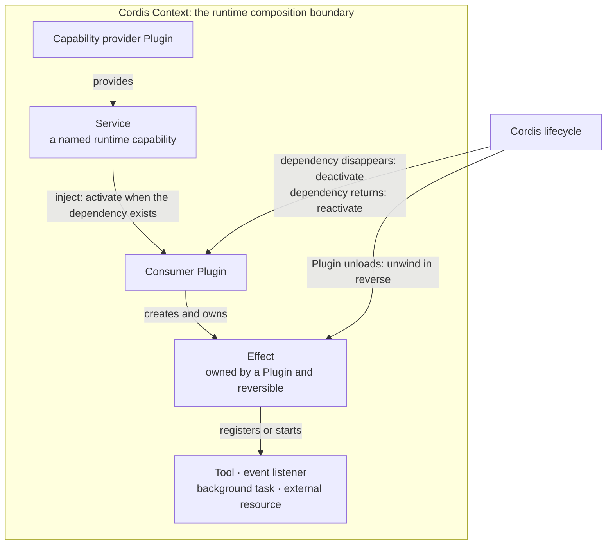
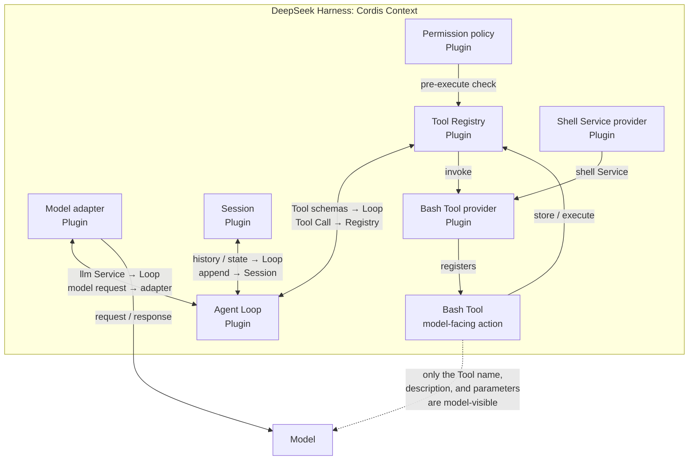

**If the Agent Loop itself is a Plugin, what is left at the center of the application?**

TL;DR: In DeepSeek Harness, a Plugin is not an attachment that merely gives the Agent another Tool. Plugins compose the runtime itself. Cordis mounts model access, the Session, Tool Registry, and Agent Loop through the same mechanism. A Tool is only a model-facing action that some Plugins provide.

> Version note: This article was checked against DeepSeek Harness commit [`47f94385`](https://github.com/deepseek-ai/deepseek-harness/commit/47f943859bef60e4160492346772ded9b24f765a) on August 16, 2026. That commit corresponds to `dsh@0.1.0-rc.5`. The project is still in developer preview, so later releases may change the design described here.

A search plugin is easy to picture. The application already exists, and the plugin adds a search command. Remove it, and the application loses search but remains the same application.

DeepSeek Harness uses the word differently. Its model adapter is a Plugin. Its Session Log and Tool Registry are Plugins. Even the default Agent Loop is a Plugin. These are not optional decorations around an otherwise complete Agent runtime. They are the parts from which the runtime is assembled.

That shift creates two questions. First, what does Plugin mean when the Plugin boundary reaches this far inward? Second, how is it different from a Tool, the action that a model can request?

Cordis answers the first question. A Bash example will make the second one concrete.

## 1. Cordis moves the Plugin boundary inward

The familiar plugin model begins with a host application. The host owns its main state and control flow, then exposes selected extension points around the edges. A plugin can add a command, a panel, or a file format, but the host remains a privileged center that plugins use rather than replace.

[Cordis](https://github.com/deepseek-ai/deepseek-harness/blob/47f943859bef60e4160492346772ded9b24f765a/docs/cordis-primer.md) starts from another boundary. It treats the running application as a **Context** into which **Plugins** contribute capabilities and behavior. A Plugin does not need a special relationship with one central application object. It finds named capabilities in the Context, adds its own contributions, and lets the Context own their lifetime.

This does not mean that there is literally no framework beneath the application. Cordis still supplies Context, dependency tracking, event dispatch, and lifecycle management. The narrower and more useful claim is that DeepSeek Harness does not keep its product-specific runtime responsibilities in a privileged core that every extension must patch. Its [architecture](https://github.com/deepseek-ai/deepseek-harness/blob/47f943859bef60e4160492346772ded9b24f765a/docs/architecture.md) puts model access, task records, Tool registration, and the default Agent Loop inside the Plugin boundary.

This is why calling the Agent Loop a Plugin is meaningful. A running Agent still needs something to drive model requests and Tool calls. "Plugin" does not mean "unnecessary." It means the default driver enters the system under the same composition rules as the Services it consumes and the components that surround it. The runtime can mount another implementation without turning that replacement into a special case in a fixed main program.

Once the host is no longer the best mental model, a new problem appears. Plugins need to find one another, wait for required capabilities, and remove everything they added when they leave. Cordis handles those jobs through Service, inject, and Effect.

## 2. Services and Effects make a Plugin reversible

A **Service** is a named runtime capability that one Plugin provides and other Plugins consume. DeepSeek Harness uses names such as `llm`, `tools`, and `agents`. A consumer asks the Context for the capability by name instead of importing one concrete provider and deciding how to construct it.

The name creates a seam. An Agent Loop needs model access, but it does not need to own the only possible model adapter. A Bash Tool provider needs shell execution, but it does not need to decide whether commands run through a local process, a sandboxed backend, or another implementation. The consumer depends on the Service contract; a provider supplies the current implementation.

Cordis uses **inject** for required dependencies. When a Plugin declares `inject: ['tools']`, it is saying that the `tools` Service must exist before the Plugin activates. Cordis waits rather than relying on a lucky load order. The rule remains active after startup: if a required Service disappears, Cordis disposes the dependent Plugin; if the Service returns, Cordis activates the consumer again. The [Service guide](https://github.com/deepseek-ai/deepseek-harness/blob/47f943859bef60e4160492346772ded9b24f765a/docs/user/develop/framework/service.md) makes this behavior explicit.

Dependency tracking answers when a Plugin may run. **Effect** answers what must disappear when it stops.

Registering a Tool changes the running system. So does attaching an event listener, opening an external resource, or starting background work. Cordis treats these changes as Effects owned by the Plugin that created them. Each Effect has a way to undo the change. When the Plugin unloads, or when a required Service disappears, the Context can unwind its Effects instead of leaving stale registrations behind.

The important relationship is not merely "Plugin A calls Plugin B." The provider owns a Service, the consumer declares that it needs the Service, and the consumer owns every Effect it creates while active.

_Figure 1. A Cordis Plugin contributes named capabilities and owns the changes that must disappear with it._

Read the diagram from the Service in both directions. To the left is replaceability: another provider can supply the same named capability. To the right is lifecycle: the consumer may activate only while its dependency exists, and its registrations live no longer than their owner. Cordis turns dependency and cleanup from conventions into runtime rules.

This is also why Plugin unloading is not just deleting one entry from a list. The useful unit of removal is the whole set of Effects created by that Plugin. A clean teardown can withdraw a Tool schema, detach listeners, stop work, and release resources together. The system then exposes only capabilities that still have a live owner.

We can now separate two words that are easy to collapse. Plugin describes who participates in the runtime and owns these Effects. Tool describes one action that the runtime may expose to the model.

## 3. A Bash Tool makes the boundary concrete

Suppose the model can call a Bash Tool. What does the model actually receive? It sees a Tool name, a description, and an argument schema that says how to provide a command. When it needs shell execution, it emits a Tool Call using that interface. This model-facing contract is the **Tool**.

The Tool does not load itself, find a shell, install permission checks, or clean up its registration. Plugins do that work.

In the logical split used by DeepSeek Harness, a Bash Tool provider Plugin registers the Bash definition with Tool Runtime. That Plugin can consume a `shell` Service supplied by another Plugin. Tool Runtime stores the current Tool definition and handles execution. Policy Plugins can inspect the call before execution. The Agent Loop asks Tool Runtime for the current schemas, sends them to the model, and later dispatches the model's Tool Call back through the registry.

The [basic Tool tutorial](https://github.com/deepseek-ai/deepseek-harness/blob/47f943859bef60e4160492346772ded9b24f765a/docs/user/develop/basic/tool.md) shows the smallest version of this relationship: the Tool is a definition registered inside a Plugin, and the Plugin uses inject to wait for Tool Runtime. The Tool is one contribution made by the Plugin, not another name for the Plugin itself.

Three small changes make the distinction obvious.

If the shell Service provider changes, the Bash Tool may keep the same model-facing name and schema while commands reach another execution backend. If the Bash Tool provider Plugin unloads, its registration Effect is withdrawn, so the Tool disappears from the current registry and from a later model request. If a policy Plugin changes, the visible Bash Tool may stay the same while the runtime changes how it checks a call before execution.

The Tool boundary is therefore narrow: it describes an action the model may request. The Plugin boundary is wider: it covers the code that joins the runtime, consumes Services, registers behavior, and remains active until its Context disposes it. One Plugin may register several Tools, one Tool, or no Tool at all.

There is also a difference in time. A Tool waits until the model calls it. A Plugin begins participating when Cordis loads and activates it. It may provide a Service, attach listeners, or start work before the model asks for any Tool. That difference will matter again when we discuss trust.

## 4. DeepSeek Harness turns runtime responsibilities into Plugins

With Plugin and Tool separated, DeepSeek Harness's architecture becomes easier to read. The system does not organize Plugins only by which Tools they add. It uses Plugins for several kinds of runtime responsibility.

Some Plugins **provide foundational capabilities**. A model adapter provides model access through the `llm` Service. Session support provides the durable facts from which model history and interface state can be derived. File-system, shell, and subprocess providers connect the runtime to an execution world.

Other Plugins **coordinate work**. Tool Registry holds the current model-facing actions and their guarded execution path. The default Agent Loop drives model requests, Tool Calls, and continuations. These coordinators are important, but importance does not move them outside the Plugin system. They consume Services and publish behavior through the same Context as other components.

A third group **changes an existing path**. Policy, telemetry, prompt, and context contributors can attach to documented events or registries. They do not need to become the Agent Loop to inspect a Tool Call or add input to the next model request. Cordis events provide the interception point; Effects give those registrations an owner.

Plugins can also **connect the runtime to the outside world**. A user interface can drive live Agents and render Session events. A persistence provider can store the same Session contract somewhere else. These components participate in the application without becoming model-callable Tools.

The next diagram uses Bash to place these roles in one view. It is a logical model, not a package graph, startup order, or deployment diagram.

_Figure 2. The model sees a Bash Tool, while the runtime coordinates the Plugins that register, check, and execute it._

The dotted line is the boundary to notice. The model does not receive the Plugin graph. It receives the current Tool schemas, then returns a Tool Call. Inside the Harness, the Agent Loop, Tool Registry, policy, Tool provider, and shell provider cooperate to turn that request into a result. Calling all of them "Tools" would hide every dependency except the last interface shown to the model.

The diagram also answers the opening question. The Agent Loop is not the fixed center through which every extension must be hard-coded. It is one coordinator inside the Context. It depends on model access, Session state, and Tool Runtime, and it can be mounted or replaced under the same rules as those capabilities. Cordis is the composition substrate; DeepSeek Harness's runtime behavior comes from the Plugin graph mounted into it.

The Context can narrow that graph for one Agent. The implemented [Agent scope design](https://github.com/deepseek-ai/deepseek-harness/blob/47f943859bef60e4160492346772ded9b24f765a/.agents/notes/implemented/architecture/2026-07-08-agent-scope-contexts.md) combines deployment-wide registrations with one Agent's local registrations. As a result, two Agents can share model and persistence infrastructure while seeing different Tools, prompt contributions, policies, or listeners. This article does not need the full assembly process yet. The important point is that scope changes which Plugin Effects are visible without changing what a Tool is.

## 5. A replaceable runtime still needs hard rules

The first benefit of this design is not the vague promise that Plugins make a system "easy to extend." The concrete benefit is that responsibilities normally fixed inside an Agent runtime become replaceable. A different model adapter, Session provider, Tool Runtime, or Agent Loop can enter through an existing Service seam. Consumers can keep depending on the capability instead of learning how every provider is built.

The same ownership model supports narrower compositions. One Agent can receive a local Tool or policy without mutating the global view for every Agent. Cross-cutting behavior can attach to an event around model requests or Tool execution instead of being copied into each provider. When the owning Plugin or Agent scope leaves, Effects give the runtime one path for withdrawing those contributions.

These gains depend on stricter runtime rules. A direct call graph is easy to follow in a debugger. A dynamic Service graph can fail because a provider is absent, a consumer has deactivated, or an Effect was disposed earlier than expected. Replacing an implementation also exposes contracts that fixed code can leave implicit, including event order, cancellation, result formats, and teardown behavior.

Compatibility becomes harder for the same reason. If the Agent Loop, Tool Registry, and Session are all replaceable, their shared assumptions must be documented. A new implementation that accepts the same method names but changes when events fire can still break its neighbors. Pluggability removes special cases from the center, then demands precision at every seam.

Trust is the sharpest boundary. A model-facing Tool waits for the model to request an action. A Plugin is trusted same-process code that begins participating when it loads. Cordis scope controls composition and cleanup; it is not a sandbox or an authority boundary. Installing a Plugin is therefore a broader trust decision than showing the model one more Tool. Article five will return to permissions and execution isolation in detail.

DeepSeek Harness's Plugin system is useful because it makes the runtime's composition rules visible. It does not eliminate complexity. It moves complexity out of a privileged center and into named dependencies, lifecycle ownership, scope, and compatibility contracts that every Plugin must obey.

Once that runtime has been assembled, a different question takes over: how does one user request move through steps and Turns, and what must the Session record so the task can resume? That is the subject of article three, ["After 'Fix This Bug': How Does DeepSeek Harness Organize Turns and Sessions?"](https://github.com/LuNa-shi/luna-shi.github.io/issues/4)

### Further reading

- [DeepSeek Harness architecture at the fixed commit](https://github.com/deepseek-ai/deepseek-harness/blob/47f943859bef60e4160492346772ded9b24f765a/docs/architecture.md)
- [Cordis primer](https://github.com/deepseek-ai/deepseek-harness/blob/47f943859bef60e4160492346772ded9b24f765a/docs/cordis-primer.md)
- [Services and dependencies](https://github.com/deepseek-ai/deepseek-harness/blob/47f943859bef60e4160492346772ded9b24f765a/docs/user/develop/framework/service.md)
- [Build a Tool](https://github.com/deepseek-ai/deepseek-harness/blob/47f943859bef60e4160492346772ded9b24f765a/docs/user/develop/basic/tool.md)
- [Agent scope design and security non-goals](https://github.com/deepseek-ai/deepseek-harness/blob/47f943859bef60e4160492346772ded9b24f765a/.agents/notes/implemented/architecture/2026-07-08-agent-scope-contexts.md)
